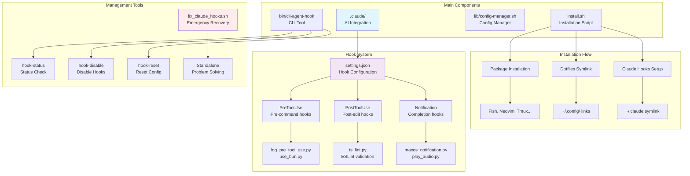

# CLI Agent Hook

A bootstrapper for CLI-based agentic code development environments. Automatically sets up development tools, configurations, and hooks for optimal AI-assisted coding workflows.

## System Architecture



## Features

- **Dotfiles Management**: Automated symlink creation and configuration deployment
- **Development Environment Setup**: Fish shell, Neovim, Tmux, and productivity tools
- **AI Integration**: Pre-configured settings for Claude and other AI development tools
- **Extensible Architecture**: Plugin-based system for custom configurations
- **Hook Management**: Comprehensive tools for managing AI integration hooks

## Quick Start

```bash
# Clone and install
git clone https://github.com/jayleekr/cli-agent-hook.git
cd cli-agent-hook
./install.sh

# Or run directly
curl -fsSL https://raw.githubusercontent.com/jayleekr/cli-agent-hook/main/install.sh | bash
```

## What Gets Installed

- **Shell Environment**: Fish shell with developer-friendly aliases and functions
- **Editor**: Neovim with NvChad configuration and AI plugins
- **Terminal**: Tmux with optimized keybindings and workflow
- **Window Management**: Aerospace tiling window manager (macOS)
- **Status Bar**: SketchyBar with system monitoring (macOS)
- **Git Workflow**: Pre-configured git aliases and hooks

## Configuration

The bootstrapper automatically creates symlinks from your dotfiles to their expected locations:

```
~/.config/fish/       -> config/fish/
~/.config/nvim/       -> config/nvim/
~/.config/sketchybar/ -> config/sketchybar/
~/.tmux.conf          -> tmux.conf
~/.aerospace.toml     -> aerospace.toml
```

## Usage

```bash
# Install all configurations
cli-agent-hook install

# Install specific components
cli-agent-hook install --component=fish

# Update existing configurations
cli-agent-hook update

# Backup current configurations
cli-agent-hook backup

# Restore from backup
cli-agent-hook restore fish

# Show system status
cli-agent-hook status

# Hook management
cli-agent-hook hook-status       # Check hooks status
cli-agent-hook hook-disable      # Disable hooks temporarily
cli-agent-hook hook-enable       # Re-enable hooks
cli-agent-hook hook-reset        # Reset to default configuration
cli-agent-hook hook-remove       # Remove hooks completely
cli-agent-hook hook-troubleshoot # Run diagnostics
```

## Hook Management Guide

### Claude Hooks System

This project includes a hook system for integration with Claude AI assistant:

- **PreToolUse**: Pre-command logging and validation
- **PostToolUse**: Automatic linting after file edits (TypeScript/JavaScript)
- **Notification**: macOS notifications and audio on task completion/interruption

### Hook Troubleshooting

#### 1. Check Hook Status
```bash
cli-agent-hook hook-status
```

#### 2. Common Issues and Solutions

**Issue: Hooks not executing**
```bash
# Run diagnostics
cli-agent-hook hook-troubleshoot

# Check hook script permissions
chmod +x ~/.claude/hooks/*.py

# Verify Python environment
python3 --version
```

**Issue: JSON configuration file errors**
```bash
# Validate configuration file
python3 -m json.tool ~/.claude/settings.json

# Reset to default configuration
cli-agent-hook hook-reset
```

**Issue: Notifications not working (macOS)**
```bash
# Check system permissions required
# System Preferences > Security & Privacy > Notifications

# Manual test
python3 ~/.claude/hooks/macos_notification.py
```

#### 3. Enable/Disable Hooks

**Temporary disable**
```bash
cli-agent-hook hook-disable
```

**Re-enable**
```bash
cli-agent-hook hook-enable
```

#### 4. Complete Removal

If hooks continue to cause issues:
```bash
# Safe removal with backup
cli-agent-hook hook-remove

# Or manual removal
rm -rf ~/.claude
```

#### 5. Fresh Installation

```bash
# Reinstall from repository
./setup_claude_hooks.sh

# Or complete reinstallation
cli-agent-hook install
```

### 🚨 Emergency Recovery Tool

Standalone script for critical hook system issues:

```bash
# Check status
./fix_claude_hooks.sh check

# Immediate disable (when problematic)
./fix_claude_hooks.sh disable

# Reset to minimal working configuration
./fix_claude_hooks.sh reset

# Complete removal
./fix_claude_hooks.sh remove

# Fresh installation
./fix_claude_hooks.sh install
```

**When to use:**
- Hooks causing infinite loops
- JSON configuration file corruption
- Claude becomes unresponsive
- Python errors preventing CLI operation

### Hook Customization

Hook scripts are located in `~/.claude/hooks/` directory and written in Python.

#### Adding New Hooks
1. Create Python script in `~/.claude/hooks/`
2. Add hook configuration to `~/.claude/settings.json`
3. Grant execute permissions: `chmod +x your_hook.py`

#### Hook Configuration Example
```json
{
  "hooks": {
    "PostToolUse": [
      {
        "matcher": "Write|Edit",
        "hooks": [
          {
            "type": "command",
            "command": "python3 ~/.claude/hooks/your_hook.py"
          }
        ]
      }
    ]
  }
}
```

## Documentation

- **[Hook Management Guide](HOOK_MANAGEMENT.md)**: Comprehensive documentation for the Claude hooks system
- **[Installation Guide](README.md)**: This file - getting started and basic usage
- **[Configuration Examples](config/)**: Sample configurations for each component